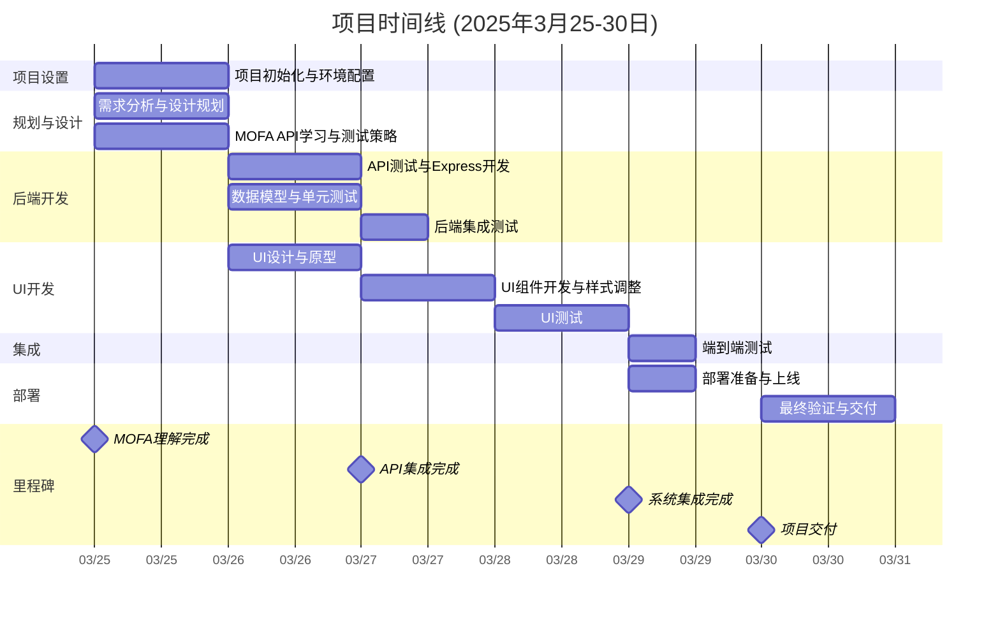

# Mofas-UI 项目文档

## 项目简介

Mofas-UI 是一个基于 Express.js、TypeScript 和 Pug 模板引擎开发的 Web 应用框架，提供了快速构建 Web 应用的基础结构。

## 技术栈

- **Node.js**: JavaScript 运行时环境
- **TypeScript**: JavaScript 的超集，添加了类型系统
- **Express.js**: Web 应用框架
- **Pug**: HTML 模板引擎
- **Morgan**: HTTP 请求日志中间件
- **Cookie-parser**: Cookie 解析中间件

## 项目结构（逐层解析）
理解项目结构是开发的第一步，以下是每个目录和文件的详细作用：
```
mofas-ui/
├── app.ts                # 项目的主入口文件，启动服务器并配置所有功能
├── routes/               # 存放路由逻辑，定义 URL 和对应的处理函数
│   ├── index.ts          # 处理首页（/）的路由
│   └── users.ts          # 处理用户相关路由（/users）
│   └── route.test.ts     # 路由测试文件
├── views/                # 存放 Pug 模板文件，用于生成 HTML 页面
│   ├── error.pug         # 错误页面模板
│   ├── index.pug         # 首页模板
│   └── layout.pug        # 通用布局模板
├── public/               # 存放静态文件
│   ├── stylesheets/      # CSS 文件
│   ├── javascripts/      # 前端 JS 文件
│   └── images/           # 图片资源
├── bin/                  # 启动脚本
│   └── www.ts            # 服务器启动配置
└── package.json          # 项目配置文件
```

## 安装与启动

### 前提条件
确保安装了：
- Node.js (推荐 v20+)
- npm
- TypeScript (`npm install -g typescript`)

### 安装依赖：
```bash
npm install
```

### 启动项目：

开发模式（支持热重载）：
```bash
npm run dev
```

生产模式：
```bash
npm start
```

构建项目：
```bash
npm run build
```

运行测试：
```bash
npm test
```

访问：http://localhost:3000

## 开发指南

### 创建新路由

假设要添加一个 /about 页面：

#### 1. 在 routes 目录下创建 about.ts：

```typescript
import express, { Request, Response, NextFunction } from 'express';
const router = express.Router();

router.get('/', (req: Request, res: Response, next: NextFunction) => {
  res.render('about', { title: '关于我们' });
});

export default router;
```

#### 2. 在 app.ts 中注册路由：

```typescript
import aboutRouter from './routes/about';
app.use('/about', aboutRouter);
```

### 创建模型

示例用户模型：

```typescript
// models/user.ts
interface IUser {
  id: number;
  name: string;
  email: string;
}

class User implements IUser {
  constructor(
    public id: number,
    public name: string,
    public email: string
  ) {}
  
  getFullName(): string {
    return this.name;
  }
}

export default User;
```

在路由中使用：

```typescript
import User from '../models/user';

router.get('/profile', (req: Request, res: Response) => {
  const user = new User(1, '张三', 'zhangsan@example.com');
  res.render('profile', { title: '用户资料', user });
});
```

## 测试

项目使用 Mocha 和 Chai 进行测试。测试文件以 `.test.ts` 结尾：

```typescript
import request from 'supertest';
import { expect } from 'chai';
import app from '../app';

describe('GET /', () => {
  it('应该返回状态码 200', (done) => {
    request(app)
      .get('/')
      .expect(200)
      .end(done);
  });
});
```

## 编程范式

本项目采用以下编程范式：

#### 中间件模式  

- Express 的灵魂，所有的请求处理都通过中间件堆叠完成。比如 Morgan 记录日志，Cookie-parser 解析 Cookie。
- 新人练习：写一个中间件检查用户是否登录。

#### MVC 架构  

- 模型（Models）：数据和逻辑，比如 user.ts。
- 视图（Views）：Pug 模板，负责展示。
- 控制器（Controllers）：路由文件，处理请求和响应。

#### 回调模式  

- Node.js 的异步处理方式，比如 fs.readFile 用的回调。
- 新人注意：可以用 async/await 替代回调，提高代码可读性。

#### 测试驱动开发（TDD）  

- 先写测试（期望结果），再写代码实现。新人可以从简单功能开始尝试。

## 常见问题

TypeScript 相关：
- 类型错误：确保正确导入类型定义
- 编译失败：检查 tsconfig.json 配置
- 运行时错误：确保所有依赖都有对应的 @types 包

- 启动失败  
  - 检查端口：netstat -aon | findstr :3000（Windows）或 lsof -i :3000（Linux）。
  - 检查依赖：npm list 查看是否有错误。
- 模板渲染错误  
  - Pug 语法对缩进敏感，确保对齐正确。
  - 检查变量名是否拼写错误。
- 路由未响应  
  - 路由顺序重要，app.use() 的顺序决定匹配优先级。
  - 检查路径是否多写或少写了斜杠 /。

## 进度图



------

## 新人建议

1. 熟悉 TypeScript 基础语法和类型系统
2. 了解 tsconfig.json 配置
3. 掌握如何使用类型定义文件（.d.ts）
4. 使用 VS Code 等支持 TypeScript 的 IDE
5. 启用 TypeScript 的严格模式，培养良好的类型习惯

通过这个项目，你将学会使用 TypeScript 开发 Express.js 应用，欢迎提问！